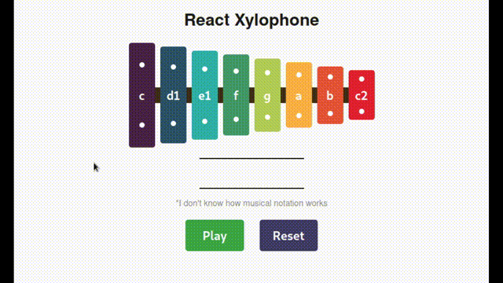

# React Xylophone

[](https://i.imgur.com/0Kdebrl.mp4)

[Click to watch with sound.](https://i.imgur.com/0Kdebrl.mp4)

Welcome to a classic react starter project with a little extra flare. This project expects you to have seen React before, understand the JSX and component syntax, but not much beyond that.

We will be exploring when and why to create reusable components, mapping over data to create components dynamically, and handling events.

## Goals

* [x] Create a working xylophone. Pressing each of the note buttons will play the tone associated with it.
* [x] Create a reusable component for the note button.
* [x] Do not manually create each note button. Instead, use of the array of objects found in `src/assets/notes.js` and a `.map` to create the components.

## Stretch Goals

* [x] Use state to keep track of notes as they are played.
* [ ] Make the `Replay` button replay all previously played notes.
* [ ] Make the `Clear` button clear previously played notes.
* [x] Use CSS to make your xylophone look like a xylophone.
* [ ] Record the relative times notes are played and use that during playback.
* [ ] Use scss mixins to make different styles for each note to reduce repeating yourself.

## Further Ideas

* [ ] Use inline styles to make the note styles. For example, by adding more properties to the notes objects (like color), and/or using math to calculate height based on index.
* [ ] Add keyboard shortcuts.
* [ ] Make a soundboard application.

## Notes

* To play an audio file using javascript, use the Audio constructor to make a new [Audio Element](https://developer.mozilla.org/en-US/docs/Web/API/HTMLAudioElement). Then, use the `play`, `pause`, etc methods.

```js
const mySound = new Auth('./path-to-file.mp3');
mySound.play();
```

* In order to hear the notes you may need to allow the page to play audio in your web browser permission.
* Audio samples are part of the [Xylophone Pack by DANMITCH3LL](https://freesound.org/people/DANMITCH3LL/packs/14220/).

## Install and Use

To run and edit the project, clone the project to your computer, `cd` into the project directory and follow the instructions below for your javascript pacakge manager of choice.

### yarn

In the project directory run `yarn install` to install the depenencies, and `yarn start` to star the development server. It should open a browser tab to `localhost:3000`.

### npm

In the project directory run `npm install` to install the depenencies, and `npm start` to star the development server. It should open a browser tab to `localhost:3000`.
